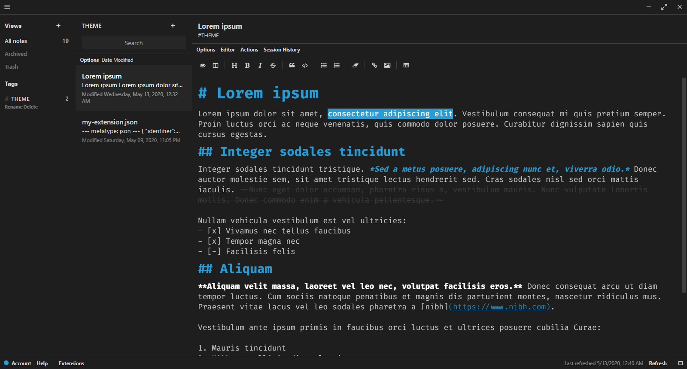

Note: GitHub repository is mirrored from GitLab. To submit pull requests or report any issues, go to [https://gitlab.com/dark-themes/uniform-dark-theme-sn](https://gitlab.com/dark-themes/uniform-dark-theme-sn "Click here to access the repository.").


## Uniform Dark+ Theme

Theme inspired by Visual Studio Code's default dark theme, designed for Standard Notes. It is based off my other [theme](https://gitlab.com/dark-themes/uniform-dark-theme-vscode "Click here to access the repository.") that unifies VS Code's default dark theme.

## Preview



I enjoy VS Code's default dark theme, however for me it appeared too *boxy*. Also, I preferred a cleaner look.

Lighter colors of user interface elements were changed to match the darker color of its Editor background. I am porting that style to Standard Notes.

Included in the theme, though&#8212;as depicted in the preview image, is my favorite editor font family: [Fira Code](https://github.com/tonsky/FiraCode "Click here to access the repository for more information."). 

Also depicted in the preview image is the fact that the theme is designed to work with the Markdown Pro editor. The editor is not included in the theme, and it requires a separate purchase (see [Standard Notes Extended](https://standardnotes.org/extensions "Click here for more information.")). The theme will work with the Plain Editor, too, but it will appear much more primitive. 

## Build from Source Code

Download and install [Standard Notes Desktop](https://standardnotes.org/ "Click here to access the download links."), or simply open [Standard Notes Web](https://standardnotes.org/ "Click here to access the link.").

Also, download and install [Git](https://git-scm.com/downloads "Click here to access the download link.").

Open a terminal, and clone the project:
```
git clone https://gitlab.com/dark-themes/uniform-dark-theme-sn.git
```

(Recommended) Verify the project's authenticity: Look upward for "Verified," next to the commit SHA.

(Recommended) Open a terminal, and verify the project's integrity:
```
cd uniform-dark-theme-sn
git show-ref --heads --hash
```
Check that the hash matches the commit SHA.

### Standard Notes Desktop

Open a terminal, and populate a remote empty public GitHub repository: \
(Up to Standard Notes 3.3.5, an empty GitLab repository had worked. 'No longer.)
```
cd uniform-dark-theme-sn
git remote rename origin old-origin
git remote add origin [empty GitHub repository URL]
git push -u origin master
```
Create and push a tag:
```
git tag -a [tag name] -m "[comment]"
git push origin [tag name]
```
Update the **download_url** address in my-extension.json: \
`"download_url": "[GitHub repository URL]/archive/[tag name].zip"`

### Standard Notes Mobile

Work in progress...

### Standard Notes Web

Create another remote empty public GitHub repository, but name it: \
`[username].github.io`

Simply upload **stylesheet.css**. No need to clone the repository.

Update the **url** address in my-extension.json: \
`"url": "https://[username].github.io/stylesheet.css"`

Note: A remote public GitLab repository will also work. In such a case, create the repository from a Pages/Plain HTML template; upload the stylesheet to the public directory; wait for the pipeline to finish running; then, update the url accordingly.

<!-- Note #2: Standard Notes cannot read the stylesheet from the parent repository. For example, it cannot read [https://raw.githubusercontent.com/saegl5/uniform-dark-theme-sn/master/stylesheet.css](https://raw.githubusercontent.com/saegl5/uniform-dark-theme-sn/master/stylesheet.css "Click here to access the raw file."). It cannot read the stylesheet, had the file been hosted on GitLab, either. -->

### Subsequent Steps

Generate an author link at [https://listed.to](https://listed.to/ "Click here to access the website.")

Open either Standard Notes Desktop or Web, and import and install the author link as an extension. Include the space at the end (i.e., "= "); do not omit it.

Create a note, and paste contents from my-extension.json into it. Then, go to Actions and select Publish to Private Link.

Obtain the **latest_url** address, which is mentioned in my-extension.json: Go to Actions, and select Open Private Link. The address will be posted in the address bar. Copy it for the next step. \
(No need to replace the latest_url address mentioned in my-extension.json, unless you want to fork the project to develop your own theme.)

## Usage

Import and install the latest_url as an extension. Then, Activate the theme.

**Do NOT activate the theme in Standard Notes Mobile, though! Not yet! The theme currently crashes Standard Notes Android, and it may crash the iOS client.**

If you purchased Standard Notes Extended, then also import, install and activate the Markdown Pro editor extension. Again, the theme will work with the Plain Editor, but it will appear much more primitive.

Note: If you change the theme, sometimes the theme in the Desktop client will not change. If so, you may need to manually remove the theme, clear the cache, close and reopen the client, and import and install the theme again. To manually remove the theme, go to Help > Open Data Directory, and open the Extensions directory; inside that, delete the theme directory; and inside the downloads directory of that, delete the theme's ZIP file. To clear the cache, go to Help > Clear Cache and Reload.

Known to work in Standard Notes Desktop 3.4.1 and Standard Notes Web 3.3.5

## Contributing

Sign into GitLab, to fork the project. \
(The repository is located at [https://gitlab.com/dark-themes/uniform-dark-theme-sn](https://gitlab.com/dark-themes/uniform-dark-theme-sn "Click here to access the repository.").)

Modify the theme. \
Stage, commit and push the changes.

Return to the GitLab repository, and submit a new pull request. \
To report any issues, submit a new issue or discuss an existing one.

## History

May 16, 2020 &middot; Version 1: repository tidied \
Apr 24, 2020 &middot; Version 0.x: initial commit

## Known Issues

- [x] ~~Theme does not work in Standard Notes 3.4.1 ([#550](https://github.com/standardnotes/desktop/issues/550))~~ - **Fixed!**
- [x] ~~Theme does not work with Web client~~ - **Fixed!**
- [x] ~~Desktop client has stronger font-weight after upgrading from version 3.3.5 to 3.4.1 ([#551](https://github.com/standardnotes/desktop/issues/551),[#14948](https://github.com/electron/electron/issues/14948))~~ - **Contrasted colors more**
- [ ] Theme crashes Android client (related to [#56](https://github.com/standardnotes/mobile/issues/56)?)

## License

MIT

Copyright (c) 2020 Ed Silkworth